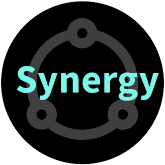

# backstage-plugin-synergy

Backstage.io plugin for **Inner-Source** dashboard. This plugin is both frontend and backend that manages and displays **Inner-Source projects and issues** from your GitHub org within Backstage. This plugin allows users to:

- Browse all the Inner-Source projects
- View details of an Inner-Source project including Pinned Issues, Open Issues, Readme & Contributing guidelines.
- Browse all the Inner-Source issues which are created in other projects (not exclusively Inner-Source).
- View details of an issue
- Check their own contributions so far
- Check the Inner-Source stats and leaderboard

See more information from our [documentation](./docs/index.md).

## Setup

Find [installation instructions](./docs/index.md#installation) in our documentation.

**IMPORTANT**: This plugin only works with the new backend system. If you are still
using the old backend system, please migrate to the new backend system first.

## Examples

Home page (Projects List):

Project page (Pinned Issues):

Project page (Open Issues):

Project page (Readme):

Project page (Contribution Guidelines):

Issues List:

User Contributions:

Statistics & Leaderboard:

## Contributing

All contributions are very welcome. See [CONTRIBUTING](CONTRIBUTING.md) for more information.

If your organization uses this plugin, we'd love to have you listed in our [ADOPTERS](ADOPTERS.md) list! ❤️

## License

This library is under the [MIT](LICENSE) license.
