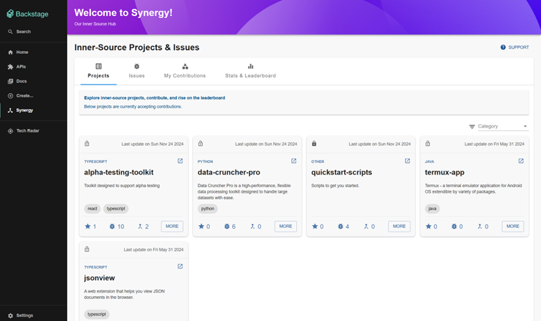
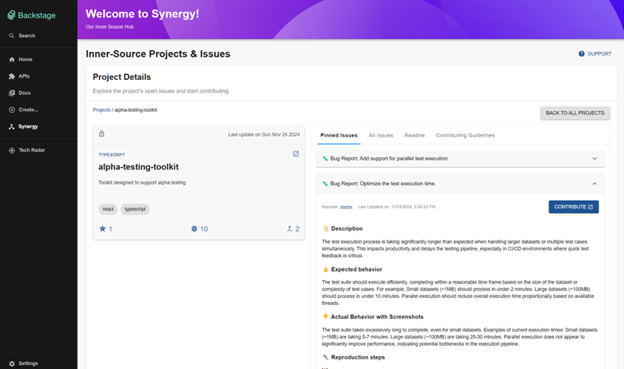
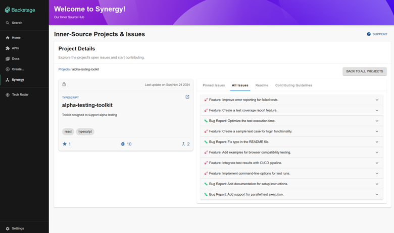
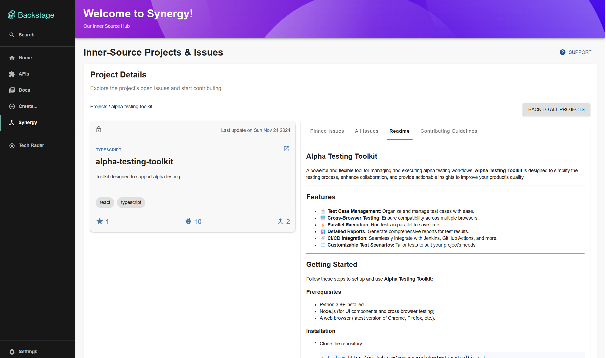
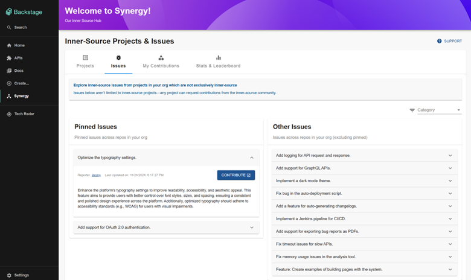
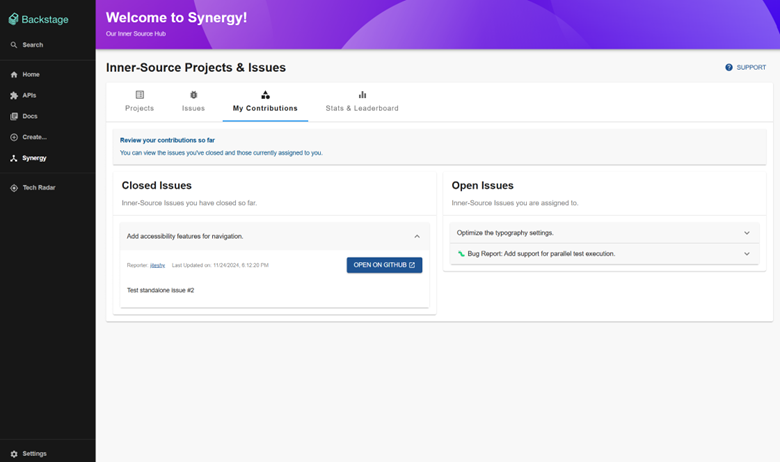
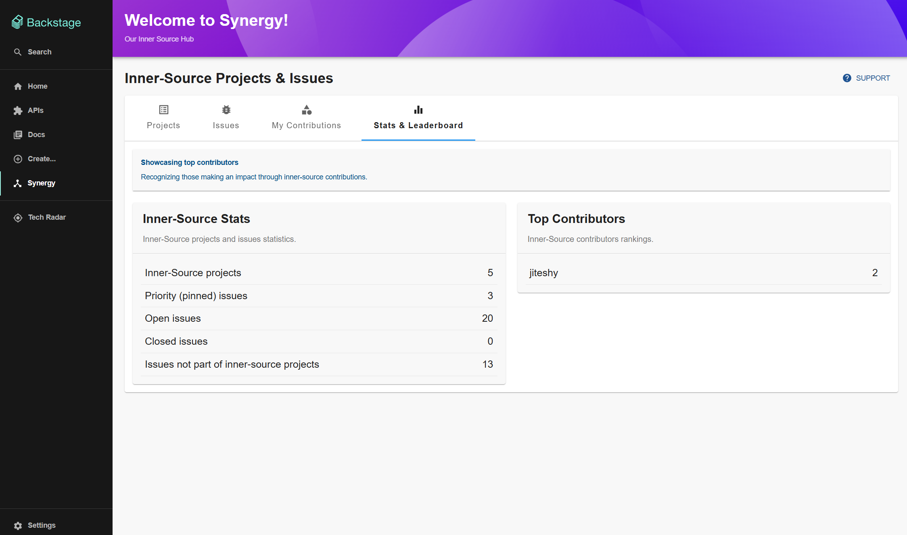

## Examples

Home page (Projects List):

Project page (Pinned Issues):

Project page (Open Issues):

Project page (Readme):

Project page (Contribution Guidelines):

Issues List:

User Contributions:

Statistics & Leaderboard:

